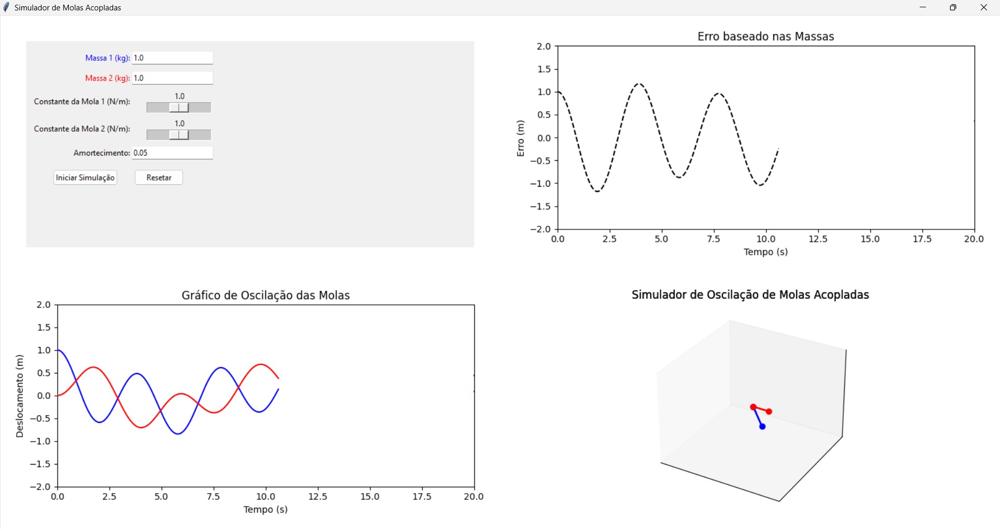
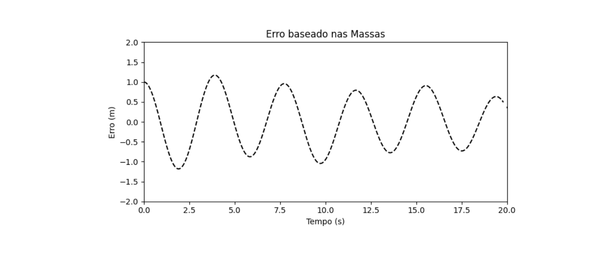

## Resultados e Discussão

Neste experimento, observamos a oscilação de dois sistemas de molas acopladas por meio de simulações gráficas e tridimensionais. A seguir, discutimos os resultados obtidos em cada um dos cenários propostos.

*Figura 1: Interface do simulador de molas acopladas.*

### Gráfico de Oscilação das Molas

O gráfico de oscilação, mostrado na Figura 2, ilustra o deslocamento das duas massas \( m_1 \) e \( m_2 \) ao longo do tempo. Observa-se que, conforme a energia se transfere entre as molas, suas oscilações tornam-se gradativamente sincrônicas ou opostas, dependendo das condições iniciais. Esse comportamento é importante para compreender a dinâmica de sistemas ressonantes.

*Figura 2: Gráfico de Oscilação das Molas.*

### Simulador 3D

A simulação tridimensional demonstra o movimento das massas \( m_1 \) e \( m_2 \) em um espaço tridimensional. Embora a mola pareça esticada, essa simplificação visa destacar o movimento oscilatório das massas. Na prática, este tipo de simulação pode ser aplicado em engenharia mecânica e civil, onde sistemas de amortecimento e molas são essenciais.

*Figura 3: Animação tridimensional do sistema de molas acopladas.*

### Erro das Massas

O gráfico de erro entre as massas \( m_1 \) e \( m_2 \), mostrado na Figura 4, evidencia a diferença de deslocamento entre as duas. Este erro é particularmente útil para avaliar a eficiência do sistema em distribuir energia entre as massas de forma uniforme. Quando o erro é mínimo, o sistema apresenta uma oscilação harmoniosa, o que indica uma distribuição de energia eficiente.

*Figura 4: Erro entre as massas \( m_1 \) e \( m_2 \).*

### Entradas das Variáveis

As variáveis de entrada do experimento foram ajustadas para investigar diferentes configurações do sistema. As massas, constantes de mola e o amortecimento têm efeitos significativos na oscilação observada. A Figura 5 ilustra as variáveis utilizadas e suas respectivas influências no comportamento dinâmico do sistema.

*Figura 5: Entradas das variáveis do sistema de molas.*
